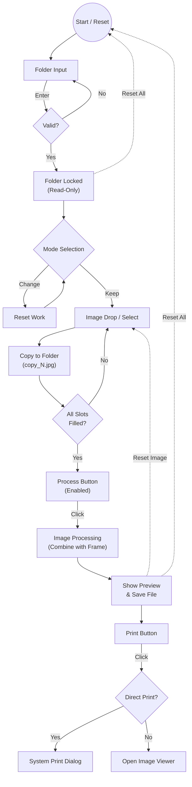

# Bittara Photo Application Pipeline

이 문서는 Bittara Photo 애플리케이션의 작동 흐름(Pipeline), 상태 관리, 그리고 주요 시스템 메커니즘을 설명합니다.

## 1. Pipeline Visualization (Tree Structure)

사용자의 행동에 따른 프로그램의 단계별 흐름과 각 단계에서의 방지책(Prevention), 되돌리기(Rollback) 로직입니다.

### 1.1 초기 상태 (Initial State)
- **Status**: `Ready`
- **Context**: 앱 실행 직후 또는 전체 초기화 후
- **UI State**: 폴더 입력 활성화, 모드 선택 가능, 드롭 영역 비활성(폴더 미지정 시)

### 1.2 폴더 설정 (Folder Setup)
- **Trigger**: `folder_input`에 번호 입력 후 `Enter`
- **Validation (Prevention)**:
  - `check_availability`: 숫자 형식 및 중복 여부 확인
  - **Dialog**: 기존 폴더 사용 시 확인 창, 신규 생성 시 안내 창
- **Action**:
  - 폴더 생성 (`create_folder`)
  - `folder_input` → **Read-Only (잠금)**
  - `open_folder_btn` 활성화
- **Rollback**:
  - **전체 초기화 (`reset_application`)**: 폴더 잠금을 해제하고 입력 필드 초기화

### 1.3 모드 선택 (Mode Selection)
- **Trigger**: "네컷 모드" / "한컷 모드" 버튼 클릭
- **Validation (Prevention)**:
  - **State Check**: 작업 중인 파일이 있다면 "초기화 경고" 다이얼로그 표시
- **Action**:
  - `current_mode` 변경
  - `DropArea` 위젯 교체 (4-slot ↔ 1-slot)
- **Rollback**:
  - 모드 변경 시 기존 `selected_files` 및 `processed_file` 자동 초기화

### 1.4 이미지 선택 (Image Acquisition)
- **Trigger**: 파일 드래그 & 드롭 OR "파일 선택" 버튼
- **Validation (Prevention)**:
  - **Folder Check**: 폴더 미설정 시 Toast 경고
  - **Slot Check**: 빈 슬롯에만 할당 (자동 순차 할당)
- **Action**:
  - **File Copy**: 원본 이미지를 대상 폴더에 `copy{N}_{filename}`으로 즉시 복사
  - **Status Update**: "N/4 이미지 준비됨" 표시
  - **Enable Process**: 모든 슬롯 충족 시 `process_button` 활성화
- **Rollback**:
  - **개별 삭제**: 이미지 썸네일의 'X' 버튼 (`remove_image` → 해당 copy 파일 삭제)
  - **사진 초기화 (`reset_image`)**: 모든 슬롯 비우기 및 copy 파일 일괄 삭제

### 1.5 이미지 가공 (Processing)
- **Trigger**: `process_button` 클릭
- **Validation (Prevention)**:
  - **Completeness**: 모든 슬롯이 채워졌는지 최종 확인
- **Action**:
  - `ImageProcessor` 호출 (프레임 합성)
  - 결과물 저장: `processed_{filename}`
  - 미리보기 렌더링: 설정된 Aspect Ratio에 맞춰 UI 표시
  - `print_button` 활성화
- **Rollback**:
  - **설정 변경**: 프레임/설정 변경 시 `reset_processed_state` 호출 (가공 결과 무효화)
  - **재가공**: 버튼을 다시 누르면 기존 `processed_` 파일 덮어쓰기

### 1.6 출력 (Output)
- **Trigger**: `print_button` 클릭
- **Action**:
  - **Direct Print ON**: 시스템 인쇄 다이얼로그 호출 (`PrintManager`)
  - **Direct Print OFF**: 기본 이미지 뷰어로 파일 열기

---

## 2. Visual Flowchart (Mermaid)

---

## 3. Critical System Mechanisms (주요 시스템 메커니즘)

파이프라인을 지탱하는 중요한 기술적 요소들입니다.

### 3.1 File Lifecycle Management (파일 생명주기 관리)
이 프로그램은 원본 보호와 데이터 무결성을 위해 **"즉시 복사(Immediate Copy)"** 전략을 사용합니다.
- **Copy on Select**: 사용자가 이미지를 선택하는 순간, 원본을 건드리지 않고 작업 폴더에 `copy{Slot}_{Name}` 형태로 복사본을 만듭니다.
- **Clean on Reset**: 사용자가 "사진 초기화"를 누르면, 단순히 UI에서만 지우는 것이 아니라 작업 폴더 내의 `copy...` 파일들을 **물리적으로 삭제**하여 디스크 공간을 관리합니다.
- **Output Isolation**: 결과물은 `processed_` 접두사를 사용하여 원본/복사본과 명확히 구분됩니다.

### 3.2 State Preservation & Locking (상태 보존 및 잠금)
- **Folder Locking**: 폴더가 한번 확정되면(`Enter`), 실수로 다른 폴더에 저장하는 것을 방지하기 위해 입력창을 `Read-Only`로 잠급니다. 이를 풀기 위해서는 명시적인 "전체 초기화" 과정이 필요합니다.
- **Mode Isolation**: 한컷 모드와 네컷 모드는 데이터 구조가 다르므로(`List[1]` vs `List[4]`), 모드 전환 시 **강제 리셋**을 수행하여 상태 꼬임을 방지합니다.

### 3.3 Dynamic Frame Resolution (동적 프레임 해석)
- **Filename Dependency**: 프레임 정보는 `frames.json`과 파일명(`filename`)을 매핑하여 관리됩니다.
- **Fallback Logic**: 만약 선택된 프레임 파일이 존재하지 않을 경우, 프로그램이 멈추지 않고 원본 이미지를 그대로 출력하도록 예외 처리가 되어 있습니다(`ImageProcessor`).

### 3.4 User Feedback System (사용자 피드백 시스템)
- **Toast Messages**: 흐름을 끊지 않아도 되는 정보(폴더 생성 완료, 잘못된 입력 등)는 비침해적(Non-intrusive)인 토스트 메시지로 처리합니다.
- **Modal Dialogs**: 데이터 손실이 발생할 수 있는 작업(초기화, 덮어쓰기)은 반드시 사용자의 명시적 승인(Yes/No)을 요구하는 모달 창을 띄웁니다.
